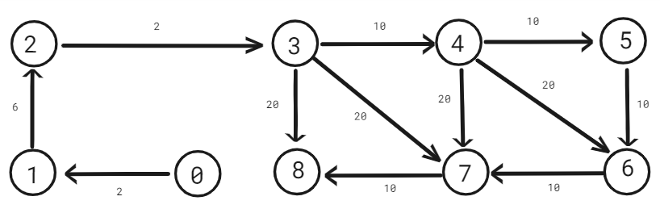
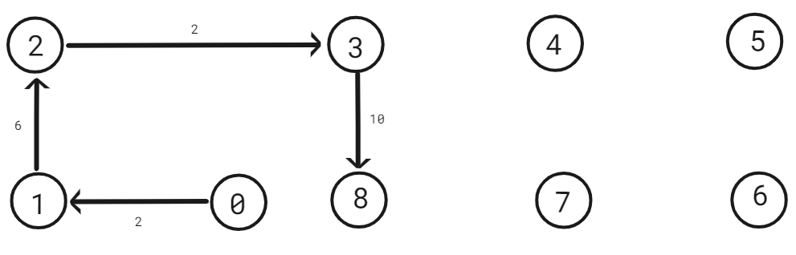

# Resistance Network Solver

This C++ program solves a network of resistors using the concept of parallel and series connections.

When it comes to solve network of resistance programitically, the first thing that comes to your mind that which data-structure should be used to represent a network of resistors ? When tackling the problem of solving a network of resistors programmatically, the first step is to understand the network and its resistances. Drawing a circuit diagram helps visualize the connections between resistors and other elements. Once the circuit is visualized, the next consideration is how to represent it in a programmatic form. So, before jumping into the solution, try to think about which data structure should be used to represent the network of resistors.

I assume that, you can can calculate total resistance of a circuit on a paper using ohm's law.

## Intution
In this solution I am going to represent the network of resistors as a directed graph where direction represent the flow of current.
Representing a network of resistors as a directed graph involves structuring the graph to capture the flow of current through the circuit. In this representation, nodes signifies junctions or points in the circuit, where edges depict resistors connecting these nodes. Each edge in the directed graph has a direction to indicate the flow of current from one node to another.

In a directed graph of a resistor network, nodes correspond to specific points in the circuit, such as junctions or terminals where current can enter or leave. Edges represent resistors and are directed from the node with higher potential to the one with lower potential, reflecting the flow of current according to Ohm's law. The resistance value of each resistor is associated with its corresponding edge.

I use the an array of mutiset to represent the graph in C++. Now you might thinking why I want to use multiset. The reason is multiset stores all elemnts in sorted order. So that computation of parallel connection is done in cheaper time complexity.

Consider the circuit given below.

To aid in understanding the relationships within the network, I provided a visual representation in the form of a network graph. The graph illustrates the connections and relationships between nodes within the network. The direction of the graph edges indicates the flow of electricity. I asseme there are V points starting from 0 to V - 1. I also assume that the electricity is go from 0 to V - 1. What I assume here is 0 is high voltage and V - 1 is low voltage.

Now, also a question comes in, how to solve it? Which traversal should be used to solve the network of resistors. Try to think about it before scrolling down. if you founnd any solution then try to solve it by yourself. if you can't do the solution by yourself then scroll down to the intution.

The intution is very simple. According to ohm's law what we solve this on a paper, the answer is try to  accumulate the resistances that are connected via series.
Which means if there are n resistors connected via series the the total resistence of the series will bw R' where R' = R1 + R2 + ... +Rn.

When n resistences are connected in parallel then the total resistence will be R' where,

1 / R' = 1 / R1 + 1/ R2 + ... + 1 / Rn.

So, R' = 1 / (1 / R1 + 1 / R2 + ... + 1 / Rn)

here is the step by step illustration how we solve it on a paper.

Since 4 till 6 their are series of connection we just acuumulate resistences placed in betweed 4 and 5, 5 and 6. which means 10 + 10 = 20.

In the previous step we see an parllel connection between 4 and 6. It this step we just calculate the total resistence from from 4 to 6 using the parallel connection formula.

In this step we just do the same thing as we do in the first step. But now we do for node 4, 6 and 7.

In this step we just do the same thing as we do in the second step. But now we do for node 4 and 7.

Similarly we do the below steps.

Yes, in this step we see electricity go directly from low voltage to high volatage, and the resistence between junction 0 and 8 is 20 ohm. because in every step we follow the ohm's law.

Now if you understand that how we solve it, then try to implement it by yourself in any programming language that you know.

I just try to do a DFS (Depth First Search) on the graph. during traversal I just do two things based on some conditions.

First of all, I check for adjacent nodes of a given node in the dfs function and look for those node who have a indegree and outdegree 1. if the condition yields true then, I just try to remove the adjacent node connect the current node to the node which is connected through the adjacent node.

You might be wondering why we do that. What is the logic behind it? The logic is very simple. When I'm at a node with an indegree and outdegree of 1, do I need to include the node in the graph? I can easily add the resistence of the adjacent node's adjacent node and remove the the adjacent node. When we solve a circuit on a paper we do that. If you still have confusion then try to write more examples and think about it.

But what should I do when the adjacent node doen't have the indegeree and outdegree 1. Before scrolling down try to build a logic by yourself to handle this situation.

If you think that we should call the dfs for the adjacent node then you are correct.

But do you think that when we should calculate the total resistence of parallel connections. we should do that after doing all operations of a node or you can say before going from dfs call.

## Algorithm Explanation:

I implement this algorithm in C++ programming language, however you can implement it in any programming language. I just explain my C++ code. It's a very high level explaination.

### Main Components:

1. **needs_resistance_adjustment**: This function checks if a node in the network needs resistance adjustment, which happens if it has only one incoming and outgoing connection.

2. **adjust_parallel_connections**: This function adjusts parallel connections in the network. It iterates over each node and its adjacent nodes to identify parallel connections. If parallel connections are found, it adjusts them by calculating the equivalent resistance.

3. **dfs**: This function performs a Depth-First Search (DFS) traversal of the network. It recursively traverses each node and its adjacent nodes to perform resistance adjustments using the above functions.

4. **calculate_indegree**: This function calculates the indegree of each node in the network, which represents the number of incoming connections to each node.

5. **calculate_total_resistence**: This function calculates the total resistance of the network by repeatedly calling the DFS function until the last node is reached.

### Steps:

1. Initialize a multiset of pairs to represent the adjacency list of the network.

2. Populate the adjacency list with node-resistance pairs according to the network connections.

3. Calculate the indegree of each node in the network.

4. Repeat DFS traversal until the last node is reached, adjusting resistances as needed.

5. Return the total resistance of the network.

## Usage

1. Compile the C++ program.
2. Run the executable.
3. The program will output the total resistance of the network.
4. You can check the program for different types of circuit.

If you find any issues with this program you can give a pull request.
